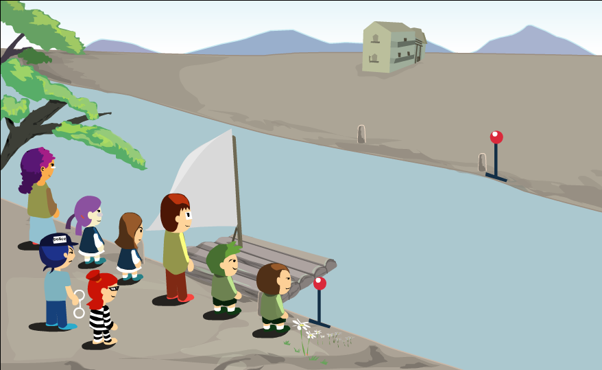

# Introduction
This is my solution for a problem we had in "Principles of designing Compiler" course in my bachelor.

# Problem


Imagine a father, a mother, a police, a thief, two girls and two boys. This group of people want to cross a river using a boat.  Considering rules below, help them to cross the river by finding the right sequence of using boat.

1. Boat's capacity is two persons maximum.
2. Only mother, father and police can drive the boat.
3. Girls can't stay with the father if mother is at the other side of the river.
4. Boys can't stay with the mother if father is at the other side of the river.
5. Thief can't stay with family members if police is at the other side of the river.
6. Police, mother and father can drive the boat solely or with another person.


# Sudo-code
```text
1. Un = [s], Ex=[]
2. n = head(Un)
3. Remove n from Un
4. If not isValid(n) got to 2
5. If IsGoal(n) then return n
6. if n ∉ Ex then
      Ex = Ex + [n]
      ChList = GenerateChildren(n)
      Un = ChList + Un
7. Go to 2

```
**Ex** : extended nodes
**UN** : unextended nodes
**Extending** : Testing for validity + Testing for Goal + Testing for being repetitive + generating its Children


# Functions to be implemented
**show()** : gets a state and returns it.

**pathShow()** : gets a sequence and a period of time and shows the elements of sequence in order of happening in given time period.

**IsValid()** : gets a state and returns true if it's a valid state, and false otherwise.

**IsGoal()** : gets a state and returns true if it's the final goal, and false otherwise.

